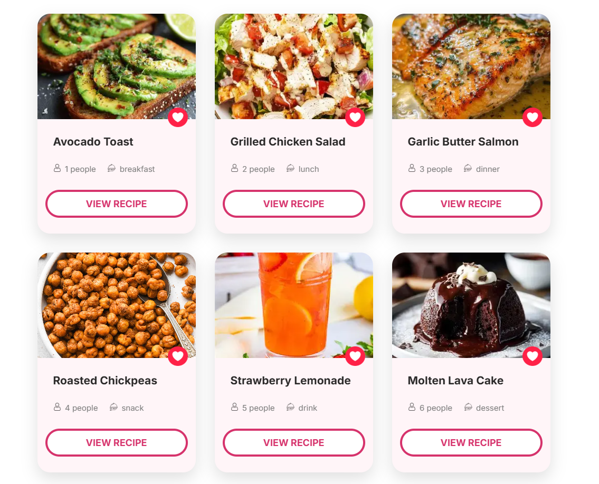
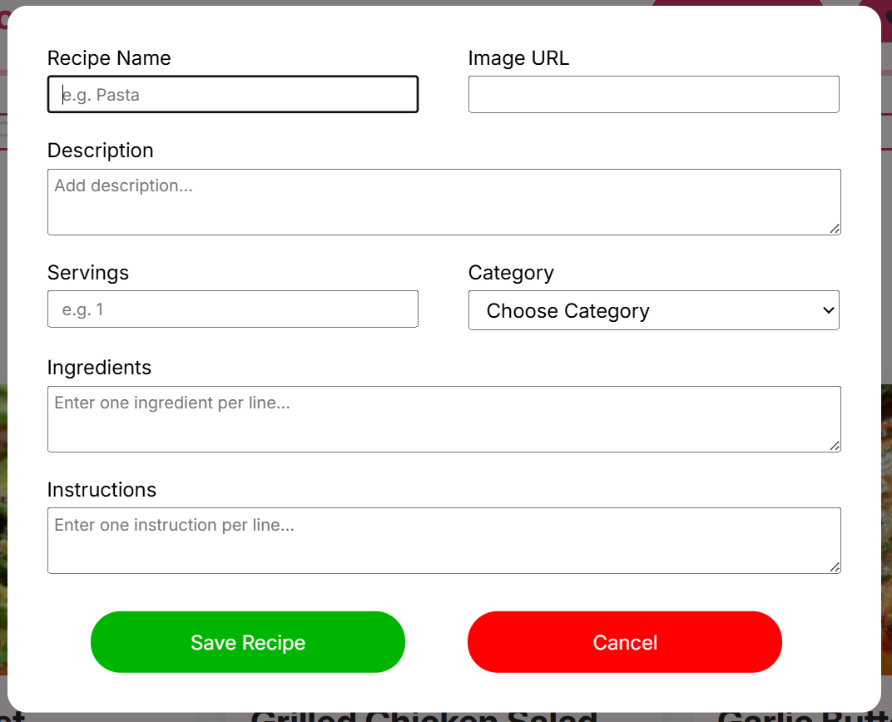
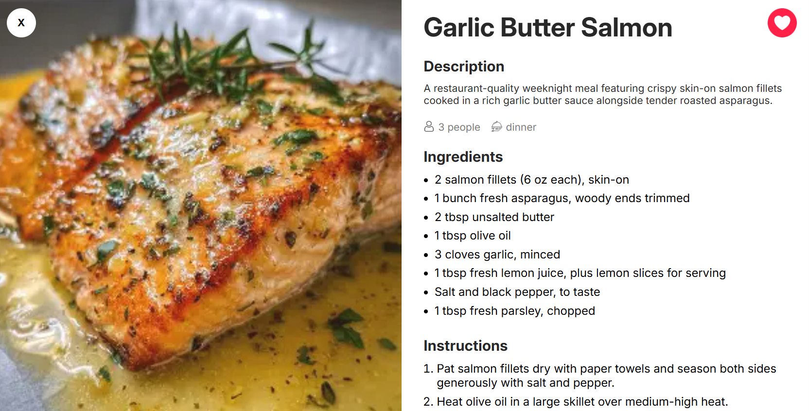

# Recipe Studio: A Comprehensive Web Application for Recipe Management
Recipe Studio is a web application designed to help users manage and organize their favorite recipes. The application provides a user-friendly interface for adding, viewing, editing, and deleting recipes, as well as filtering and searching functionality. With Recipe Studio, users can easily store and retrieve their favorite recipes, making it a valuable tool for home cooks and professional chefs alike.

## Features
The following are the key features of Recipe Studio:
* Add new recipes with detailed information, including name, description, serving size, category, ingredients, and instructions
* View all recipes in a grid layout
* Edit and delete existing recipes
* View detailed information about a selected recipe, including its name, description, serving size, category, ingredients, and instructions
* Filter recipes by category
* Search recipes by keyword

## Tech Stack
The following technologies are used in Recipe Studio:
* Frontend: HTML, CSS, JavaScript
* Backend: None (client-side only)
* Database: Local Storage
* Build Tools: Vite
* Linting and Formatting: ESLint, Prettier
* Fonts: Google Fonts

## Installation
To install Recipe Studio, follow these steps:
1. Clone the repository using `git clone`
2. Install the dependencies using `npm install`
3. Start the development server using `npm run dev`

## Usage
To use Recipe Studio, follow these steps:
1. Open the application in a web browser
2. Click the "Add Recipe" button to add a new recipe
3. Fill in the recipe details, including name, description, serving size, category, ingredients, and instructions
4. Click the "Save" button to save the recipe
5. View all recipes by clicking the "View All" button
6. Filter recipes by category using the filter dropdown
7. Search recipes by keyword using the search input

## Project Structure
```
recipe-studio/
|-- index.html
|-- package.json
|-- src/
    |-- js/
        |-- main.js
        |-- add-recipe.js
        |-- view-recipe.js
        |-- view-all.js
        |-- view-favs.js
        |-- edit-recipe.js
        |-- delete-recipe.js
        |-- filter.js
        |-- search.js
    |-- css/
        |-- style.css
        |-- header.css
        |-- footer.css
        |-- main.css
        |-- recipe-dialog.css
        |-- variables.css
        |-- reset.css
        |-- responsive.css
    |-- assets/
        |-- images/
        |-- screenshots/
|-- node_modules/
|-- README.md
```

## Screenshots

### 3x3 Recipe Cards Grid


### Form for Adding Recipes


### Recipe Details Card
